# AWS Terraform Infrastructure Project

## Project Overview

This project demonstrates Infrastructure as Code (IaC) on AWS using Terraform. The infrastructure is designed using reusable Terraform modules and follows a production-style project structure with separate environments, modules, and remote state management.

The project provisions:

* AWS VPC
* Public Subnets
* Private Subnet
* Internet Gateway
* Route Table & Associations
* Security Group
* EC2 Instance
* Application Load Balancer (ALB)
* Target Group
* Remote Terraform State using S3
* State Locking using DynamoDB

---

# Architecture

```text
Internet
    │
    ▼
Application Load Balancer
    │
    ▼
Security Group
    │
    ▼
EC2 Instance
    │
    ▼
Public Subnet
    │
    ▼
VPC
```

Terraform Backend:

```text
Terraform
    │
    ▼
S3 Bucket (Remote State)
    │
    ▼
DynamoDB Table (State Locking)
```

---

# Project Structure

```text
aws-terraform-infra/
│
├── backend/
│   ├── provider.tf
│   ├── main.tf
│   ├── variables.tf
│   ├── outputs.tf
│   └── terraform.tfvars.example
│
├── environments/
│   └── dev/
│       ├── provider.tf
│       ├── backend.tf
│       ├── main.tf
│       ├── variables.tf
│       ├── outputs.tf
│       ├── terraform.tfvars
│       └── terraform.tfvars.example
│
├── modules/
│   ├── vpc/
│   │   ├── main.tf
│   │   ├── variables.tf
│   │   └── outputs.tf
│   │
│   ├── security-group/
│   │   ├── main.tf
│   │   ├── variables.tf
│   │   └── outputs.tf
│   │
│   ├── ec2/
│   │   ├── main.tf
│   │   ├── variables.tf
│   │   └── outputs.tf
│   │
│   └── alb/
│       ├── main.tf
│       ├── variables.tf
│       └── outputs.tf
│
├── screenshots/
├── README.md
└── .gitignore
```

---

# Technologies Used

* Terraform
* AWS EC2
* AWS VPC
* AWS S3
* AWS DynamoDB
* AWS Application Load Balancer
* AWS Security Groups
* AWS Route Tables
* AWS Internet Gateway
* Git
* GitHub

---

# Key Features

### Remote State Management

Terraform state is stored remotely in an S3 bucket.

Benefits:

* Centralized state storage
* Team collaboration
* State backup and recovery

### State Locking

DynamoDB is used to prevent simultaneous Terraform operations.

Benefits:

* Prevents state corruption
* Ensures safe infrastructure updates

### Modular Design

Reusable modules were created for:

* VPC
* Security Group
* EC2
* ALB

Benefits:

* Reusability
* Maintainability
* Scalability

---

# Terraform Workflow

Initialize Terraform

```bash
terraform init
```

Validate Configuration

```bash
terraform validate
```

Preview Infrastructure Changes

```bash
terraform plan
```

Create Infrastructure

```bash
terraform apply
```

View Outputs

```bash
terraform output
```

Destroy Infrastructure

```bash
terraform destroy
```

---

# Screenshots

## Backend Infrastructure

### Terraform Apply Success

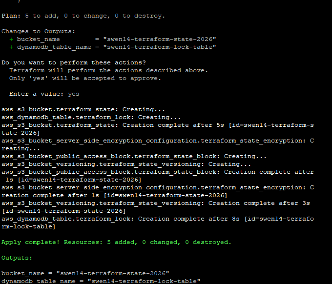

### S3 Bucket Created

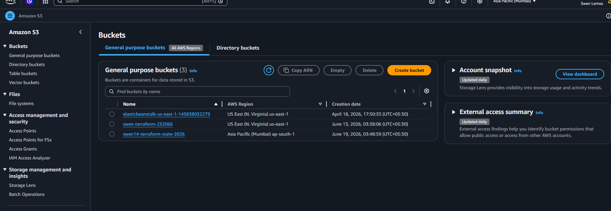

### S3 Versioning Enabled

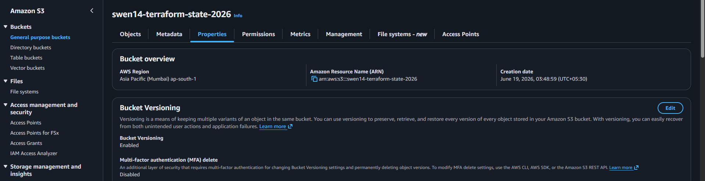

### S3 Encryption Enabled

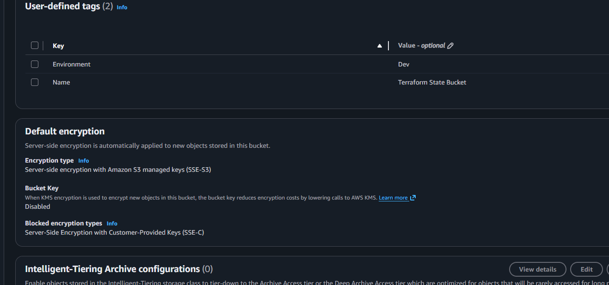

### S3 Public Access Blocked

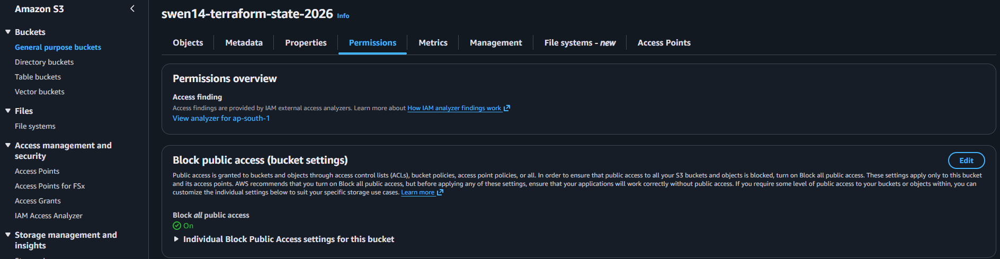

### DynamoDB Table Created

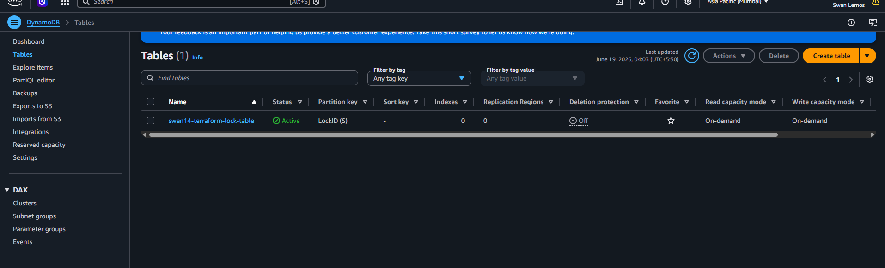

---

## Development Environment

### VPC Created

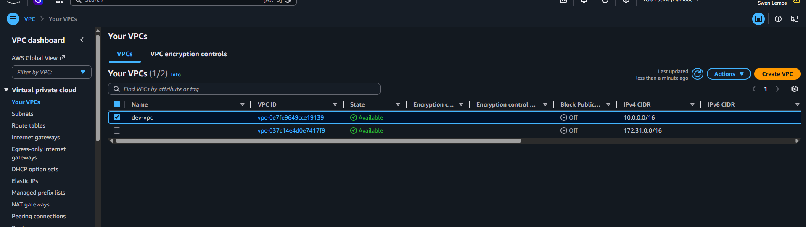

### Public and Private Subnets


### Internet Gateway Created

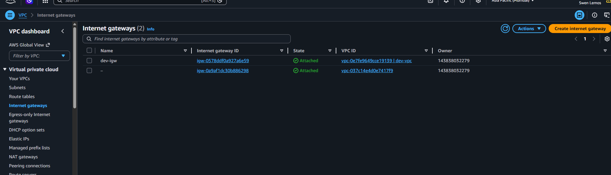

### Route Table Created

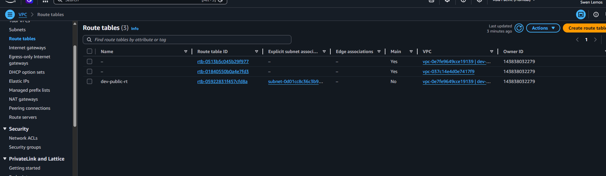

### Security Group Created

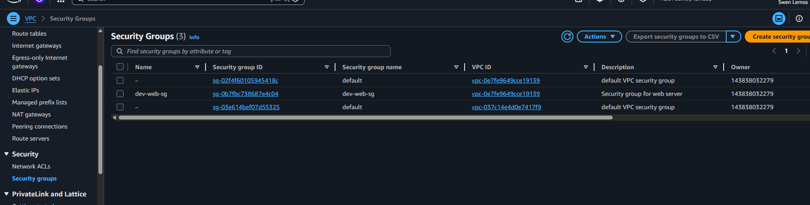

### EC2 Instance Created

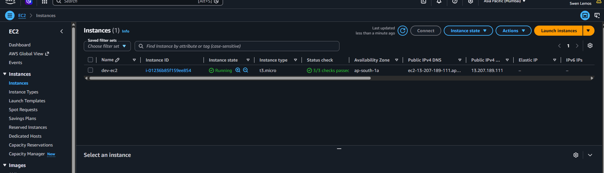

### Application Load Balancer Created

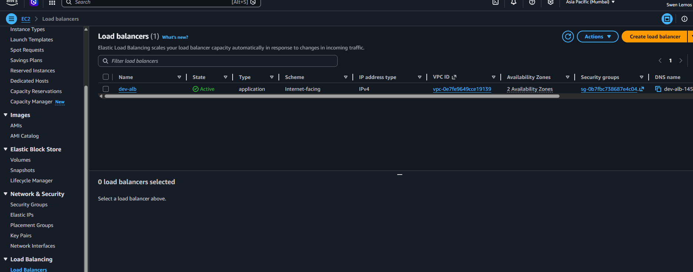

### Target Group Created

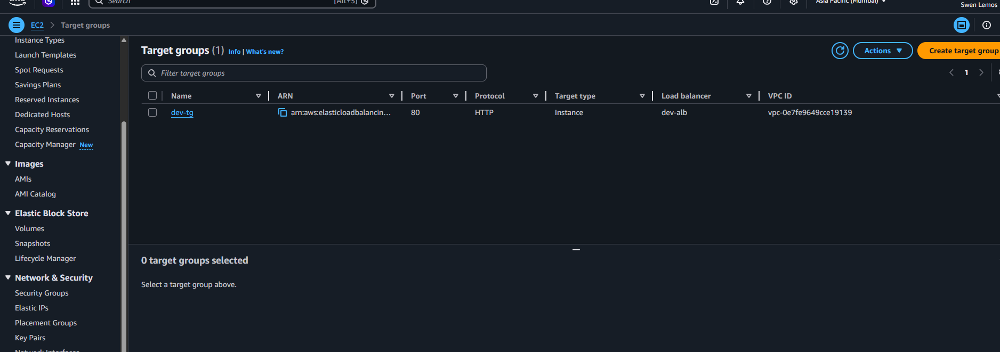

### Terraform Outputs

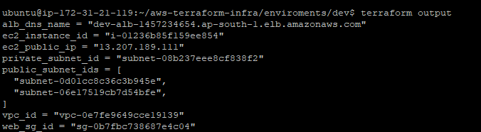

---

# Learning Outcomes

Through this project I learned:

* Infrastructure as Code (IaC)
* Terraform State Management
* Remote State with S3
* State Locking with DynamoDB
* Terraform Modules
* AWS Networking Fundamentals
* Security Groups
* Load Balancing Concepts
* Environment-Based Infrastructure Design
* Git and GitHub Integration
* Infrastructure Automation

---

# Future Improvements

* Auto Scaling Group
* NAT Gateway
* Multi-Environment Setup (Dev, Staging, Prod)
* Route53 Integration
* HTTPS using ACM
* CI/CD Pipeline using GitHub Actions
* Terraform Cloud Integration

---

# Author

Swen Lemos

Aspiring DevOps Engineer | AWS | Linux | Terraform | Git | Infrastructure as Code
